

## البيان | Al-Bayan

<strong>البيان</strong> تطبيق إسلامي متكامل يجمع قراءة القرآن الكريم والتلاوات الصوتية وخطة للحفظ، مواقيت الصلاة والأذان والقبلة، الأذكار، والأحاديث — في تجربة واحدة سلسة بواجهة عربية أنيقة ودعم الوضع الليلي. يعمل دون إنترنت بعد التحميل.

<h3>🔗 روابط التطبيق:</h3>

<ul style="list-style-position: inside; padding-right: 16px; padding-left: 0; margin: 0;">
  <li>🌐 الموقع الرسمي: 
    <a href="https://engahmedmo.github.io/al-bayan" target="_blank">
      https://engahmedmo.github.io/al-bayan
    </a>
  </li>
  <li>📥 تحميل تطبيق الأندرويد (APK):
    <a href="https://github.com/EngAhmedMo/al-bayan/releases/download/v1.0.0/Al.Bayan.apk" target="_blank">
      تحميل مباشر
    </a>
  </li>
  <li>💻 تحميل نسخة الويندوز (Setup EXE):
    <a href="https://github.com/EngAhmedMo/al-bayan/releases/download/v1.0.0/al-bayan_0.1.0_x64-setup.exe" target="_blank">
      تحميل مباشر
    </a>
  </li>
  <li>💻 تحميل نسخة الويندوز (MSI):
    <a href="https://github.com/EngAhmedMo/al-bayan/releases/download/v1.0.0/al-bayan_0.1.0_x64_en-US.msi" target="_blank">
      تحميل مباشر
    </a>
  </li>
  <li>💻 تحميل نسخة الويندوز المحمولة (Portable):
    <a href="https://github.com/EngAhmedMo/al-bayan/releases/download/v1.0.0/Al.Bayan.Portable.exe" target="_blank">
      تحميل مباشر
    </a>
  </li>
</ul>

<h3>✨ أهم المميزات:</h3>

<ul style="list-style-position: inside; padding-right: 16px; padding-left: 0; margin: 0;">
  <li>📖 القرآن الكريم بخط واضح، تكبير/تصغير، بحث داخل المصحف، علامات مرجعية، وتلاوة آية بآية مع تظليل تفاعلي واختصارات ذكية للوحة المفاتيح للتصفح السريع.</li>
  <li>🔁 أدوات تكرار متطورة ومخصصة للحفظ والمراجعة:
    <ul style="list-style-type: circle; padding-right: 20px; margin: 4px 0;">
      <li>تكرار الآية (عدد مرات محدد أو مستمر).</li>
      <li>تكرار الآية مع الاستمرار والتشغيل المتصل (تلقائي الانتقال).</li>
      <li>تكرار الصفحة بالكامل.</li>
      <li>تكرار السورة بالكامل.</li>
      <li>تكرار نطاق مخصص (من الآية رقم إلى الآية رقم) مع شريط تحكم مزدوج وعرض مباشر ومزامن للآيات وتشغيل متواصل بدون فجوات (Gapless Range Repeat).</li>
    </ul>
  </li>
  <li>🎧 مكتبة صوتية شاملة: تلاوات عالية الجودة لـ 27 قارئاً من كبار مشايخ التلاوة، مع ميزة تحميل الصوت للاستماع بدون إنترنت، وواجهة مرنة تتناسب مع جميع مقاسات الشاشات والأوضاع.</li>
  <li>📻 إذاعات إسلامية مباشرة: 47 إذاعة بث مباشر (قرآن لمختلف القراء، تفسير، فتاوى، سيرة نبوية، وأذكار) مع ميزة مؤقت النوم (Sleep Timer) والتشغيل في الخلفية مع التحكم من الإشعارات.</li>
  <li>📚 تفاسير مختارة: ابن كثير، الجلالين، والتفسير الميسر.</li>
  <li>🧠 نظام ذكي لحفظ القرآن الكريم بخطط متعددة + خيارات مرنة للورد اليومي (صفحة كاملة، نصف صفحة، ربع صفحة) + ميزة الورد الإضافي والتراجع + تكرار متباعد (SRS) + اختبارات ذاتية + تتبع التقدم والإنجازات ومشاركة النتائج.</li>
  <li>🕌 مواقيت الصلاة والأذان عبر حساب داخلي بطرق حساب متعددة ومعتمدة لمناطق مختلفة، مع مؤذنين متنوعين، وتنبيهات قبل الصلاة.</li>
  <li>🧭 بوصلة القبلة ومؤشر دقة.</li>
  <li>📿 الأذكار والتسبيح: مكتبة أذكار + عداد تسبيح يدعم الاهتزاز التفاعلي (Haptic Feedback) + مفضلة + إمكانية إضافة أذكار مخصصة.</li>
  <li>📕 الأحاديث النبوية: قاعدة بيانات داخلية منظمة تشمل الكتب الستة، مع بحث سريع ومتقدم.</li>
  <li>📅 التقويم الهجري والمناسبات + عدّ تنازلي للأيام المهمة + ويدجت التاريخ الهجري للشاشة الرئيسية.</li>
  <li>🌙 تنبيهات رمضان: تذكير السحور والإفطار وتنبيهات العشر الأواخر (مع تمييز ليالي الوتر).</li>
  <li>🕋 دليل الحج والعمرة خطوة بخطوة + أدعية مأثورة.</li>
  <li>💻 خصائص ممتازة لنسخة الديسكتوب (EXE): دعم أزرار التحكم بالوسائط من النظام، ميزة البدء التلقائي الصامت مع إقلاع الويندوز (Silent Autostart)، ونسخة محمولة بالكامل تعمل بدون تثبيت.</li>
</ul>

<h3>🔔 تنبيهات ذكية قابلة للتحكم:</h3>

<ul style="list-style-position: inside; padding-right: 16px; padding-left: 0; margin: 0;">
  <li>تنبيهات الصلاة والاذان</li>
  <li>أذكار الصباح والمساء</li>
  <li>تذكير الورد اليومي للحفظ</li>
  <li>تنبيهات الصلاة على النبي ﷺ (نصية وصوتية) ويمكن التحكم بها من إعدادات الإشعارات والتنبيهات</li>
</ul>

<h3>✅ المصادر والموثوقية</h3>

<ul style="list-style-position: inside; padding-right: 16px; padding-left: 0; margin: 0;">
  <li>تم الاعتماد علي مصادر موثوقة ومعروفة في الأقسام الأساسية (القرآن الكريم، التفاسير، الأذكار، والأحاديث).</li>
  <li>تم الاستفادة ايضا من أدوات ومكتبات مفتوحة المصدر لتحسين الاستقرار والأداء.</li>
  <li>في حال ملاحظة أي خطأ غير مقصود أو محتوى يحتاج مراجعة، نرجو إبلاغنا ليتم التدقيق والتصحيح في أقرب تحديث.</li>
</ul>

<h3>✨ لماذا البيان؟</h3>

<ul style="list-style-position: inside; padding-right: 16px; padding-left: 0; margin: 0;">
  <li>✅ مجاني بالكامل بدون إعلانات وبدون أي اشتراكات أو دفع</li>
  <li>✅ يعمل دون إنترنت بعد التحميل</li>
  <li>✅ تصميم أنيق مع وضع ليلي مريح</li>
  <li>✅ واجهة عربية واضحة وسهلة</li>
</ul>

## 📸 صور من التطبيق

<table>
  <tr>
    <td align="center">
      <a href="screenshots/01-home.jpg">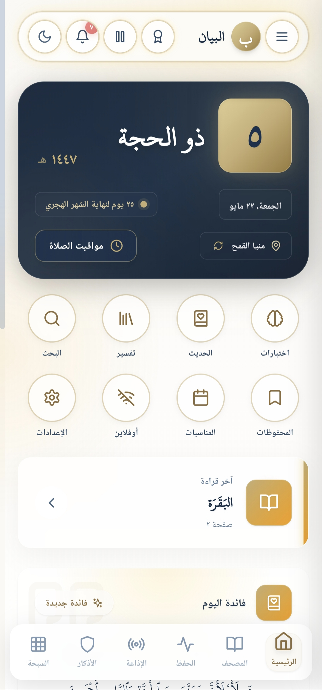</a>
      
الرئيسية

    </td>
    <td align="center">
      <a href="screenshots/02-quran.jpg">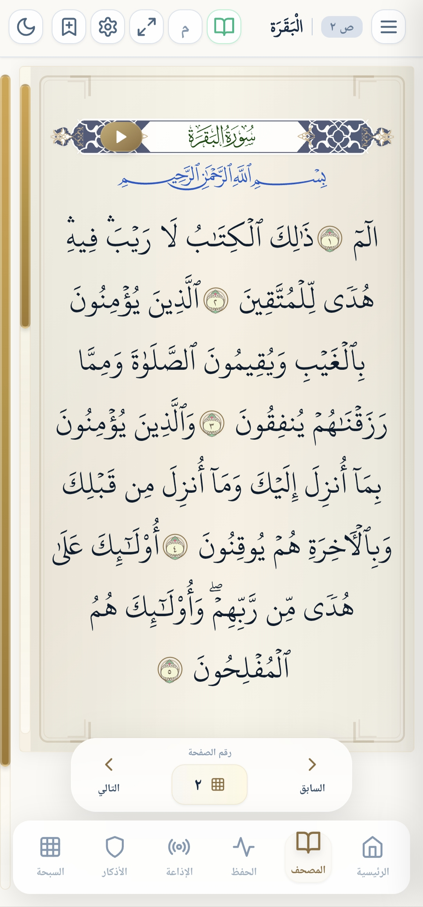</a>
      
المصحف

    </td>
    <td align="center">
      <a href="screenshots/03-prayer-times.jpg">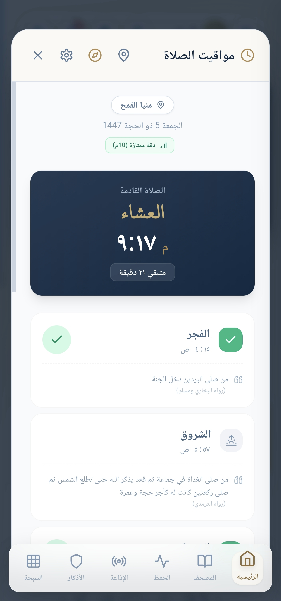</a>
      
مواقيت الصلاة

    </td>
    <td align="center">
      <a href="screenshots/04-qibla.jpg">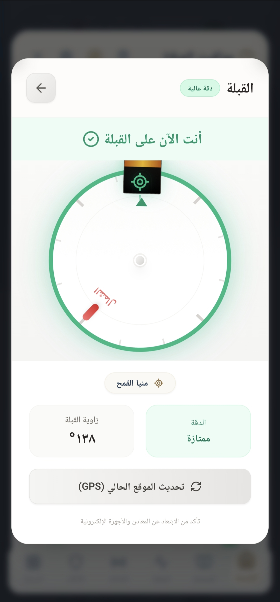</a>
      
القبلة

    </td>
  </tr>

  <tr>
    <td align="center">
      <a href="screenshots/05-hifz-plan.jpg">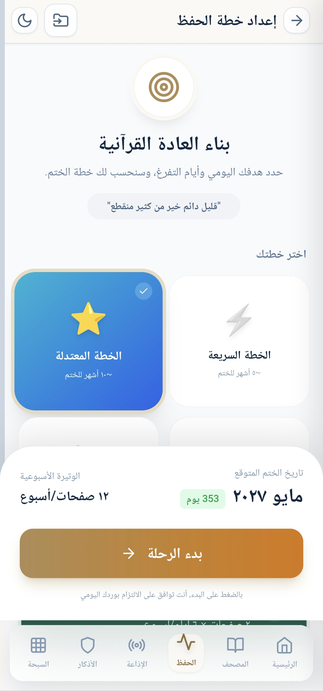</a>
      
خطة الحفظ

    </td>
    <td align="center">
      <a href="screenshots/06-tasbeeh.jpg">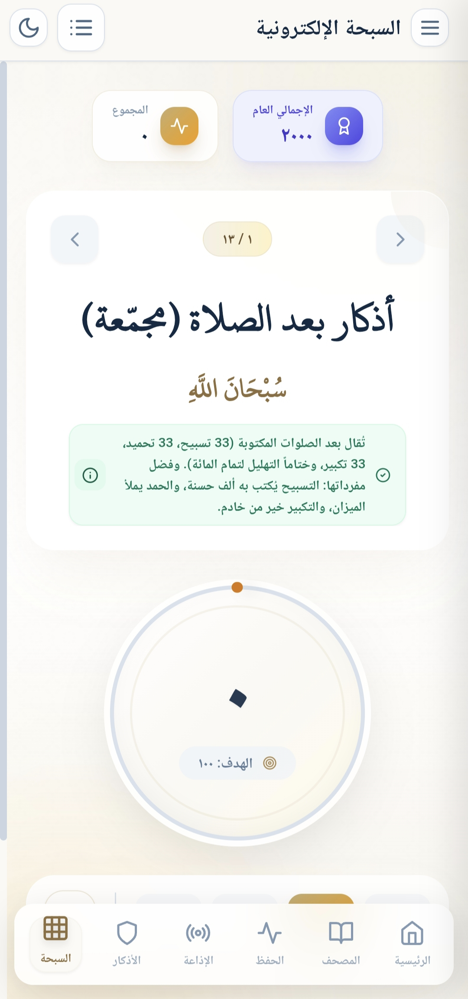</a>
      
السبحة

    </td>
    <td align="center">
      <a href="screenshots/07-adhkar.jpg">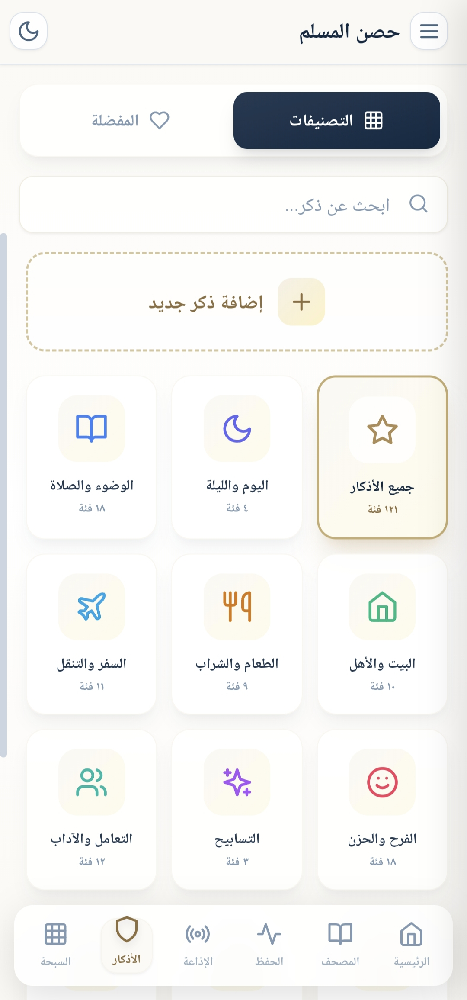</a>
      
الأذكار

    </td>
    <td align="center">
      <a href="screenshots/08-hadith.jpg">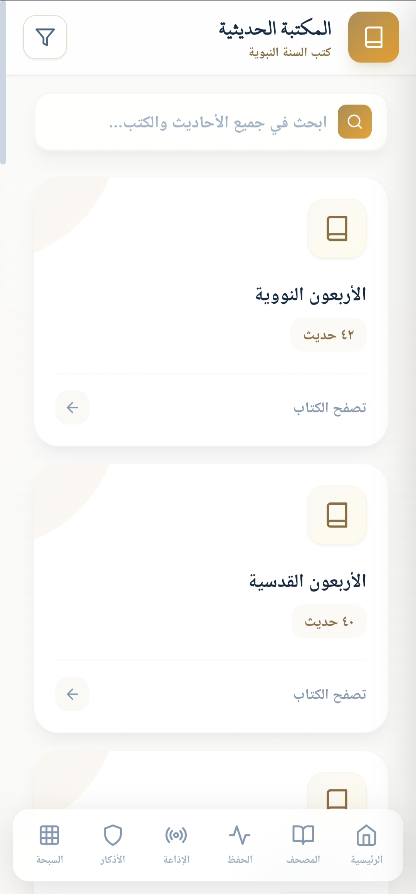</a>
      
المكتبة الحديثية

    </td>
  </tr>

  <tr>
    <td align="center">
      <a href="screenshots/09-radio.jpg">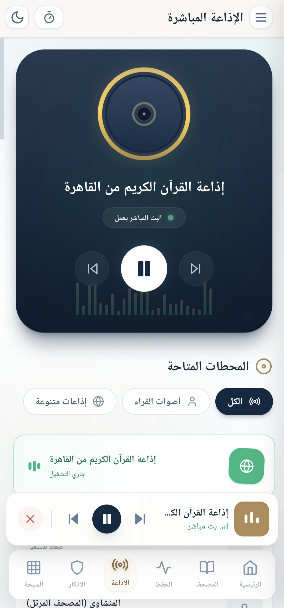</a>
      
الإذاعة المباشرة

    </td>
    <td align="center">
      <a href="screenshots/10-occasions.jpg">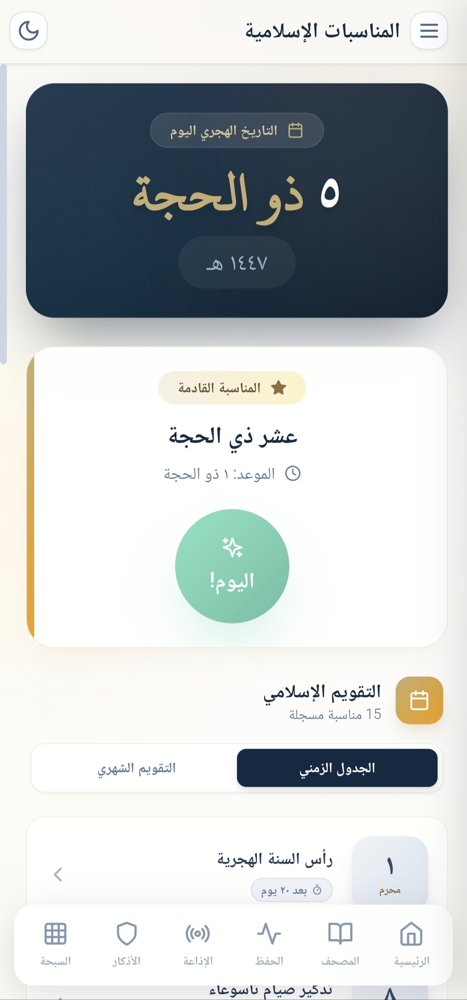</a>
      
المناسبات الإسلامية

    </td>
    <td align="center">
      <a href="screenshots/11-widget.jpg">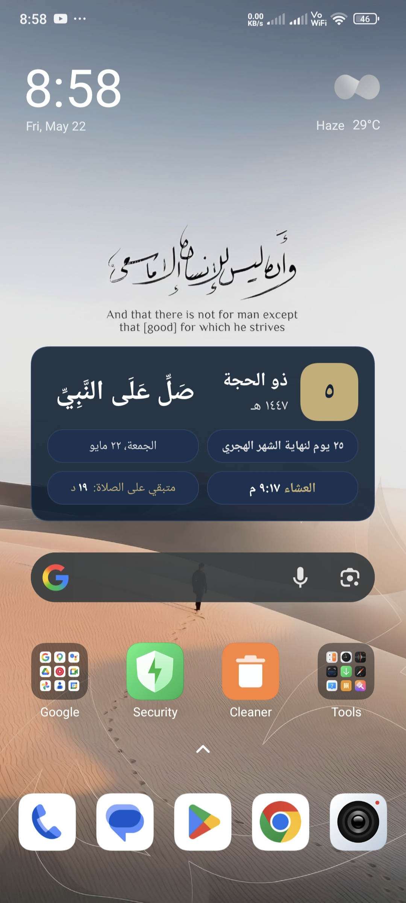</a>
      
ويدجت التاريخ الهجري

    </td>
  </tr>
</table>

اضغط على أي صورة لفتحها بالحجم الكامل.

